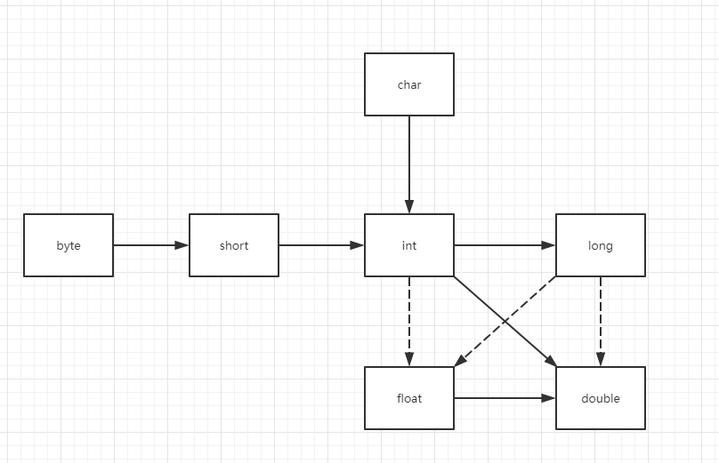

# 卷一 第三章(4)

## 3.5 运算符

1. 算术运算符有：+、-、*、/

2. **/** 参与的运算中，两个操作数**都是整数**时，便是**整数**除法；否则，表示**浮点**除法

3. **%** 为求余操作。

4. 当整数被0除将抛出一个异常。而**浮点数**被0除将得到**无穷大**(例如：10.3d/3，得到：Infinity)或**NaN**结果。

### 3.5.1 数学函数与常量(Math类)

在现在的运算中，有个长期存在的问题，即：如果被除数是负数，那么求余操作(%)的余数将是一个负数。显然不对，因为余数总是**≥0**的。所以，可以使用**Math.floorMod**方法计算，此时计算出来的将是一个≥0的余数。但是在除数为负数时，还是存在小于0的余数。  

**注意：**如果要得到一个更为准确的结果，那么应该使用**StrictMath**类。

## 3.5.2 数值类型之间的转换



1. 实心箭头表示无信息丢失的转换，有6个。虚箭头表示可能有精度损失的转换，有3个。

2. 对两个数值进行二元操作时，要先将两个的数值转换为同一种类型，再进行计算。

   1. double,all → double,double

   2. float,all except double → float,float

   3. long,all except double/float → long,long

   4. all except double/float/long, all except double/float/long → int,int。即byte,short → int,int; int, char → int,int

### 3.5.3 强制类型转换

强转换是指：高精度数据类型向低精度数据类型转换。例如：double → int。可能会丢失一些信息。  

强制转换的语法格式是在圆括号中给出想要转换的目标类型，后面紧跟待转换的变量名。

### 3.5.4 结合赋值和运算符

在赋值中使用二元运算符，可以这样写：x += 4; 等价于 x = x + 4;  

类型不同时，也会发生类型强制转换。

### 3.5.5 自增与自减运算符

“前缀”自增、自减： ++n、--n  

“后缀”自增、自减：n++、n--

**注意：**

1. 这样的运算符操作的是**变量**，所不能是数值，例如4++。

2. 前缀会先完成加1，后缀会先使用原来的变量再加1。  

   ```java
   int m = 7;
   int n = 7;
   int a = 2 * ++m; // now a is 16, m is 8;
   int b = 2 * n++; // now b is 14, n is 8
   ```
### 3.5.6 关系和boolean运算符
**==、！=、<、>、<=、>=** 为关系运算符。 

&&表示逻辑“与”运算符，||表示逻辑“或”运算符。&&和||运算符是按照“**短路**”方式来求值的：如果第一个操作数已经能够确定表达式的值，第二个操作数就不必计算了。  

三元操作符：**?:**。即：condition ? expression1 : expression2;  When condition is true, expression1 will be executed.  

### 3.5.7 位运算符

**&("and")  |("or")  ^("xor")  ~("not")**为位运算符。  

用于处理**整型类型(byte,short,int,long)**的数值时，对组成的**各个位**进行操作。  

&、| 这两个运算符也是可以应用在布尔值的计算上。与&&和||不同的是，**不采用**“短路”方式求值。即：对于&、|两个连接的表达式都是会进行计算布尔值，再得到最终的布尔值。  

\>>、<<这两个也是位运算符，用于将位模式的右移或左移。\>>用符号位填充高位  

例如：001011 \>> 3  = 000001 ； 001011 << 3  =  011000 ；  

\>>> 运算符会用0填充高位。例如：001011 >>> 3 = 000001；

```java
int y = -0b11000;
System.out.println(y);
System.out.println(Integer.toBinaryString(y)); // 11111111111111111111111111101000
int y1 = y>>2;
System.out.println(y1);
System.out.println(Integer.toBinaryString(y1));// 11111111111111111111111111111010
int y2 = y<<3;
System.out.println(y2);
System.out.println(Integer.toBinaryString(y2));// 11111111111111111111111101000000
int z = y>>>2;
System.out.println(z);
System.out.println(Integer.toBinaryString(z)); // 00111111111111111111111111111010,高位两个0位填充的
```

**不存在 <<< 这样的符号**  

### 3.5.8 括号与运算级别

略  

### 3.5.9 枚举类型

1. 变量的取值只在一个有限的集合内。可以使用枚举类型。
2. 枚举类型包括有限个命名的值。
3. 枚举类型的变量只能存储这个类型声明中给定的某个枚举值。