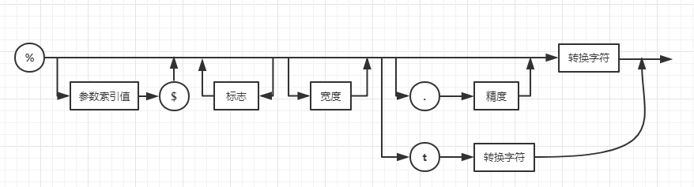

# 卷一 第三章(6)

### 3.6.6 码点和代码单元

1. Java字符串由**char**值序列组成。而char数据类型是一个采用UTF-16编码表示Unicode码点的代码单元，其中大多数常用的Unicode字符使用一个代码单元表示，辅助字符需要一对代码单元表示。

2. String的对象的length方法可以返回采用UTF-16编码表示的给定字符串所需要的代码单元数量。得到的实际长度即码点数量。

3. 调用s.charAt(n)将返回位置n的代码单元，即返回第n个位置的字符。0 ≤ n ≤ s.length()-1之间。

4. 字符串转由int值对应的码点，用

   ```java
   int[] codePoints = str.codePoints().toArray();
   ```

   转回字符串要使用String的构造函数。

   ```java
   String str = new String(codePoints, 0, codePoints.length);
   ```
### 3.6.7 String API(略)
### 3.6.8 阅读联机API文档(略)
### 3.6.9 构建字符串
1. **每次连接字符串，都会构建一个新的String对象。**浪费时间也浪费空间。

2. 使用**StringBuilder类**避免上述问题。使用append方法。

3. StringBuffer和StringBuilder的区别：

   1. StringBuffer是StringBuilder的前身。

   2. StringBuffer允许采用多线程的方式执行添加或删除字符的操作。而StringBuilder是单线程。
## 3.7 输入输出
### 3.7.1 读取输入

1. 使用Scanner对象进行控制台窗口输入。```Scanner in = new Scanner(System.in); ```


### 3.7.2 格式化输出

1. 使用**System.out.printf** 方法，格式化参数进行打印。

2. 在printf中，可以使用多个参数。例如：```System.out.printf("Hello, %s. Next year, you'll be %d", name, age);```

   每一个以**%字符开始**的格式说明符都用相应的参数转换。格式说明符**尾部**的转换符将指示被格式化的数值类型：f表示浮点数，s表示字符串，d表示十进制整数。

   **用于printf的转换符**

   | 转换符 |         类型         |                举例                 |
   | :----: | :------------------: | :---------------------------------: |
   |   d    |      十进制整数      |                 159                 |
   |   x    |     十六进制整数     |  ```System.out.printf("%x",15);```  |
   |   o    |      八进制整数      |  ```System.out.printf("%o",16);```  |
   |   f    |      定点浮点数      |                15.9                 |
   |   e    |      指数浮点数      |              1.59e+01               |
   |   g    |      通用浮点数      |                -----                |
   |   a    |    十六进制浮点数    |             0x1.fccdp3              |
   |   s    |        字符串        |                Hello                |
   |   c    |         字符         | ```System.out.printf("%c",1330);``` |
   |   b    |         布尔         |                True                 |
   |   h    |       散列码？       |               42628b2               |
   | tx或Tx | 日期时间(T强制大写)  |     已经过时，应使用java.time类     |
   |   %    |        百分号        |                  %                  |
   |   n    | 与平台有关的行分隔符 |               ------                |

   **用于printf的标志**

   |      标志       |                             目的                             |                             举例                             |
   | :-------------: | :----------------------------------------------------------: | :----------------------------------------------------------: |
   |        +        |                     打印正数和负数的符号                     | ```System.out.printf("%+d",3232);```<br/> ```System.out.printf("%+10d",5645);``` |
   |      空格       |                      在正数之前添加空格                      | ```System.out.printf("% d",5645);```<br/> ```System.out.printf("% 10d",5645);``` |
   |        0        |                         数字前面补0                          |            ```System.out.printf("%010d",3333);```            |
   |        -        |                            左对齐                            |            ```System.out.printf("%-10d",3333);```            |
   |        (        |                       将负数括在括号内                       |            ```System.out.printf("%(d",-3333);```             |
   |        ,        |                        添加分组分隔符                        |             ```System.out.printf("%,d",3333);```             |
   |  #(对于f格式)?  |                          包含小数点                          |            ```System.out.printf("%#f",3333.);```             |
   | #(对于x或0格式) |                        添加前缀0x或0                         | ```System.out.printf("%#x",2365);```<br />```System.out.printf("%#o",2365);``` |
   |        $        | 给定被格式化的参数索引。例如：%1$d,%1$x将以十进制和十六进制格式打印第一个参数 | ```System.out.printf("%1$d,%1$x,%1$o",2365);```<br />```System.out.printf("%1$d,%1$#x,%1$#o",2365);``` |
   |        <        | 格式化前面说明的数值。例如：%d%<x以十进制和十六进制打印同一个数值。 |       ```System.out.printf("%1$d,%<#x,%<#o",2365);```        |

3. 可以用**s转换符**格式化任意的对象。

4. 使用静态的**String.format**方法创建一个格式化的字符串。

5. printf方法中的日期与时间的格式化选项。格式包括2个字母，以t开始。以表3-7(第59页)的任意字符结束。

#### 格式说明符的语法图：



?:  
散列码: hash code
